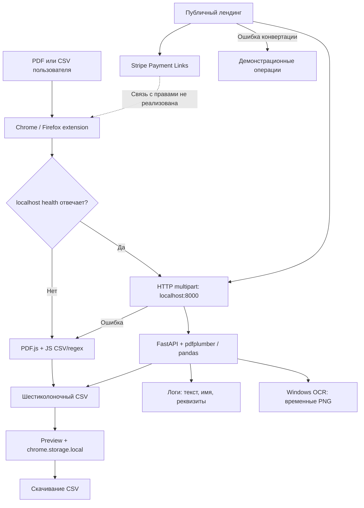

# Аудит Statement2Muster (BankSync DACH)

**Вердикт: NO-GO для коммерческого релиза в заявленном объёме.** Проект содержит работающие элементы конвертации и три доступных Stripe Checkout, но не обеспечивает связку «оплата → права → защищённая конвертация → корректный бухгалтерский импорт». Найдены воспроизводимые ошибки потери операций, смешения клиентов и финансовых сумм. Обещание Zero Retention не соответствует нескольким путям обработки.

Реестр содержит **31 позицию: 18 P1, 12 P2 и 1 P3**. P1 блокируют выпуск соответствующей функциональности. P2 должны быть устранены до публикации затронутой платформы или B2B/cloud-функции; меньший номер приоритета не заменяет зависимость релиза от исправления. P3 относится к документации и сопровождению.

## 1. Границы и достоверность выводов

Срез: **8 сентября 2026**, локальный проект `C:\Users\zorik\Documents\Obsidian Vault\10_Projects\Statement2Muster`. Последний коммит: `671b12d`, 2026-09-07. В рабочем дереве уже изменён документ структуры репозитория. Анализ выполнен по текущим файлам; исходники, Stripe и настройки опубликованных расширений не изменялись.

Проверены PRD, описание стека, структура, README, весь backend, оба `app.js`, manifests/background scripts Chrome и Firefox, основные страницы лендинга и юридические тексты. `app.js` в Chrome, Firefox и обоих ZIP v1.0.2 совпадает по SHA-256: `905005f75660ad4ed4c507667d89af6a092c4734ab9afa306c265b764c69d6ef`. Это распространяет найденные дефекты данного файла на локальные дистрибутивы v1.0.2, но не доказывает состав пакетов, уже установленных из магазинов.

Публичный лендинг и все три Stripe Payment Links прочитаны в браузере. На публичном лендинге воспроизведено переключение на годовые цены. Платежи не выполнялись; Stripe Dashboard, live event deliveries, секреты, база лицензий, конфигурация Hetzner, reverse proxy и фактические банковские импорты не исследовались. Отсутствие интеграции в этой кодовой базе не доказывает отсутствия внешнего сервиса, но такой сервис не подключён к проверенной логике авторизации и конвертации.

Оба существующих теста backend проходят. Дополнительно выполнены локальные пробы на синтетических данных. Python-проверки использовали Python 3.12.14, pandas 3.0.1 и pdfplumber 0.11.9 из доступного runtime, а не точный production lock. Тело `convert_statements` исполнено через AST с подменой транспортных типов: это проверка бизнес-логики, **не HTTP/ASGI/multipart-тест**. JavaScript-проверки исполняли извлечённые функции приложения; PDF разбирался фактической библиотекой PDF.js 3.11.174 из проекта. Встроенный warning об отсутствии standardFontDataUrl не препятствовал извлечению текста синтетического PDF. Полноценный запуск расширений в Chrome/Firefox не выполнялся.

Используются обозначения доказательств: **К** — установлено по коду; **В** — воспроизведено локальной пробой; **П** — видно на публичной странице; **Н** — эксплуатационная конфигурация не подтверждена. В реестре рекомендация отделена от факта. Юридическая часть — анализ полноты и соответствия заявлений реализации, без удостоверения регистрации компании или выдачи юридического заключения.

В сохранённой папке `.venv` метаданные указывают FastAPI 0.110.0, Starlette 0.36.3, pandas 2.2.1, pdfplumber 0.11.0, python-multipart 0.0.9; это отдельное подтверждение dependency-среза, не доказательство запущенного production environment. Исходник multipart-парсера в ней прочитан для проверки spooling. Файлы зависимостей исключены из manifest хешей исходного проекта.

Исходный реестр прежнего аудита Lamis A01–AXX в исследованных заметках не найден. Сохранена запрошенная методика: приоритет, доказательство, последствие, remediation и критерий приёмки.

## 2. Фактическая архитектура

| Компонент | Описание в документации | Обнаруженная реализация |
|---|---|---|
| Extension | PDF/CSV отправляется в API | Локальный JavaScript-движок; при обнаружении localhost сначала используется локальный Python API |
| Backend | FastAPI, PostgreSQL, учёт лимитов, Stripe | Один маршрут конвертации, healthcheck и необязательная раздача статики; БД, auth, entitlement и webhook-код отсутствуют |
| Parsing | Парсеры банков, возможный Gemini | Amex + общий regex/pdfplumber parser; Windows OCR; CSV-разбор в main.py; вызовов Gemini нет |
| Landing | Next.js + Tailwind, auth/dashboard | Статические HTML/CSS/JS; вход имитируется alert; demo обращается к 127.0.0.1 |
| Billing | Stripe | Публичные Stripe Links работают; связь с доступом в проверенном коде отсутствует |
| Hosting | Hetzner; на лендинге Frankfurt | Vercel-конфигурация публикует landing; контейнер описан, но фактическое размещение API не подтверждено |

В расширении `checkBackendHealth` проверяет только `127.0.0.1` и `localhost`, каждые пять секунд. Production-домены в manifest не делают облачный API активным. Результат зависит от того, что запущено на компьютере клиента. При ошибке API расширение автоматически меняет алгоритм на JS. После добавления auth это поведение нельзя сохранять для 401/403/429: отказ в доступе не должен запускать альтернативный платный путь.

В текущем локальном режиме банковские документы не отправляются в Stripe и не обнаружено отправки в Gemini. Stripe получает данные своего checkout. Различать эти потоки необходимо и в политике приватности. Сам факт локальной обработки не даёт «100% GDPR compliance» и не делает локальную историю эфемерной.

## 3. Stripe и продуктовые обещания

| Тариф | Публичный Stripe Checkout | Лендинг | Заключение |
|---|---|---|---|
| [Starter](https://buy.stripe.com/cNi6oH9vDcnL2v0dWTebu03) | €4,90 ежемесячно; описание ограничивает 20 выписками/месяц | €4,90/месяц; безлимит; 7 дней бесплатно | Цена/месячный интервал совпадают. Capabilities противоречат. На просмотренном checkout бесплатные 7 дней и отложенное списание не показаны |
| [Business PRO](https://buy.stripe.com/14AfZh6jr2NbedI6urebu04) | €29 ежемесячно; безлимит, batch, priority support | €29/месяц; дополнительно Anti-Mix, dedup, шаблоны контирования, безлимитная история | Базовые условия совпадают. Дополнительные обещания требуют реализации и привязки к правам |
| [Lifetime](https://buy.stripe.com/14A00j6jrfzX2v0bOLebu05) | €89 разово; бессрочное использование без ежемесячной платы | €89 разово; все будущие банки и пожизненные обновления | Цена и одноразовый характер совпадают. Объём будущих обязательств на лендинге шире описания checkout |

На всех трёх страницах продавец отображается как Grecciani Labs. EUR выбран; одновременно доступен выбор UAH. Следовательно, **EUR как показанная цена подтверждён, «платёж всегда только EUR» — нет**. Не следует делать вывод о валюте settlement по интерфейсу checkout. Если бизнес требует фиксированное списание только в EUR, проверить и согласовать настройки локализации валюты/Adaptive Pricing. Налоговый режим, tax_behavior, VAT ID, B2B reverse charge и итог после ввода адреса покупателя по этому просмотру не удостоверены.

Публичный переключатель «год» меняет Starter на €49/год и PRO на €290/год, но оставляет прежние месячные URL. `data-plan` не меняет Stripe Price. Это воспроизведено на live-лендинге. Дополнительно €290/12 ≈ €24,17, а показано €24/месяц. До появления двух реальных годовых Price/Checkout убрать переключатель. Три текущие ссылки для этого заменять не требуется.

**Lemon Squeezy не считается используемым провайдером.** Старое имя файла и CSS-класс с `lemon` — остатки документации/наименований, а не свидетельство подключённого биллинга.

Продуктовая ценность для Kanzlei — проверяемая полнота, разделение клиентов и предсказуемый импорт. Обещание «3 секунды» вторично, если исправление CSV вручную занимает больше времени, чем исходная обработка. MVP следует позиционировать через подтверждённые банк/формат/модуль, а не через «все банки» и перечень бухгалтерских брендов без import evidence.

При одинаковом объёме прав Lifetime €89 равен примерно **3,1 месячным платежам PRO** или **18,2 платежам Starter**, без учёта налогов, комиссий, скидок и затрат. Это арифметическое сравнение, не оценка LTV. При неограниченном cloud/OCR и пожизненной поддержке себестоимость продолжается после единственной оплаты. До расширения продаж Lifetime определить, включает ли он локальное ПО, обновления, облачный OCR и поддержку, и посчитать contribution margin на фактическом распределении использования. Уже проданные права нельзя молча урезать новым техническим лимитом.

Пилот должен измерять: долю файлов поддержанного профиля без ручной правки, долю неполных распознаваний, расхождение балансов, время исправления пользователем, стоимость CPU/OCR на файл, support minutes на клиента, успешность первого импорта и долю возвратов. В существующем коде доказательств этих метрик нет. Для них достаточно агрегатов без хранения текста выписок.

## 4. Реестр дефектов и рисков

Ссылки на файлы расшифрованы в разделе 10. После двоеточия указаны исходные номера строк. Владелец — рекомендуемая зона работы Antigravity; решения о тарифах и юридические реквизиты утверждает владелец продукта.

| ID | Приоритет | Факт и доказательство | Последствие | Remediation и приёмка |
|---|---|---|---|---|
| A01 | **P1** | К: BE:35–206 — convert принимает только files, без identity/token/license/entitlement; CORS `*` | Любой, кто достигает этого deployment, может вызывать дорогую обработку без оплаты. Публичная доступность конкретного сервера Н | Backend: auth до разбора тела, проверка tenant/плана/квоты. Без токена 401; без права 403; parser не вызван |
| A02 | **P1** | К: EXT:341–346, 1496–1505, 1522–1584 — isLoggedIn означает PRO; social login фиктивный; клик по счётчику возвращает 5 попыток | Бесплатный доступ без Stripe; для обхода не нужны даже DevTools | Extension + backend: удалить mock-login и reset; реальная identity, серверные права. Очистка storage/переустановка не обновляет серверную квоту |
| A03 | **P1** | К: во всём backend нет Stripe webhook, `STRIPE_WEBHOOK_SECRET`, выдачи/отзыва ключей, БД прав; Н: внешний сервис | Оплата не привязана к выдаче доступа; отмена/возврат не отзывают права в проверенном приложении | Billing: signed webhook inbox, entitlement state machine, идемпотентность, reconciliation. Paid/cancel/refund/replay E2E проходят |
| A04 | **P1** | П/К: Starter checkout — 20/месяц; IDX:495–496 — unlimited + 7-day trial | Покупатель принимает несогласованные условия, риск претензий/возвратов | Product/Billing: единый каталог; выбрать 20 или unlimited, подтвердить trial в Stripe либо убрать. Checkout и лендинг показывают одинаковые условия |
| A05 | **P1** | П/К: LAND:290–311 меняет годовые цены, но не href; IDX:501,524 — месячные links | Пользователь выбирает годовой тариф, попадает в месячную подписку | Landing/Billing: отключить annual до реальных annual prices; тест выбранный plan → правильный interval/amount |
| A06 | **P1** | К: EXT:60,214–240,936–948; LAND:5; VERCEL:1–4 — topology не соответствует PRD | Обычный клиент не получает описанный облачный сервис; local/cloud движки дают разные результаты | Architecture: выбрать режим, явный endpoint, никаких автоматических fallback после отказов auth. Проверка на чистом компьютере без localhost |
| A07 | **P1** | К: LAND:135–141 подставляет sample после ошибки реального файла; 234–241 может скачать прошлый currentDemoCsvText | В интерфейсе результат не относится к загруженной выписке; возможен экспорт старого клиента | Landing: ошибка остаётся ошибкой; sample только отдельным действием, очистка результата перед новым запросом. Broken input не создаёт успешный download |
| A08 | **P1** | В/К: EXT:1059–1079 — фильтр всегда true; BE:189 и EXT:1109–1117 теряют account/source; обе раздельные выгрузки содержат A+B | Заявленный Mandantenschutz распространяет операции одного клиента в CSV другого | Core/UI: сохранять tenant/account/source на каждой операции; строгий partition, default deny при неизвестном счёте. CSV A содержит только A, CSV B только B |
| A09 | **P1** | В/К: BE:149–155; EXT:841–850 — dedup по date/text/amount, без account/currency/reference | Разные реальные операции исчезают; EUR и USD с одинаковым текстом/суммой схлопываются | Core: не удалять по эвристике; reference + account/currency + provenance; кандидаты показывать для решения. Повторные реальные платежи сохраняются |
| A10 | **P1** | В/К: EXT:502–515 объединяет всю страницу пробелами, затем 544–549/596–603 требуют начало строки | Дефолтный PDF-путь пропускает обычные операции. Синтетический Amex даёт 0 вместо 1 | Core: восстановить строки/колонки по геометрии PDF.js и hasEOL; golden PDFs, headers/footers, многостраничность; текстовые fixtures недостаточны |
| A11 | **P1** | В/К: PAR:37,104–106,437–464; EXT:371–384,523–553 — год страницы применяется без rollover, невозможные даты принимаются | 31.12.2025 становится 31.12.2026 в выписке января 2026; 31.02 проходит | Core: calendar date, statement period, booking/value dates отдельно; неоднозначность блокирует экспорт; year-boundary/leap-year fixtures |
| A12 | **P1** | В/К: PAR:467–507 выбирает последнее число и всегда EUR; BE:100–110 хранит сырой amount; EXT:1104 | `1,234.56 → 1,23456`; saldo вместо debit; USD маркируется EUR; `-12.34` в preview превращается в `-1234` | Core: bank schema, Decimal, валюты и FX отдельно; неизвестные форматы отклонять; суммы и знаки сверяются с эталоном по валютам |
| A13 | **P1** | В/К: EXT:419,862–866,1096; 1401/1410 — CSV без escaping, split(';'), UTF-8 Blob под CP1252 label | `SHOP;Branch` сдвигает колонки; quoted multiline ломается; повторное скачивание портит umlauts | Core/UI: единый CSV reader/writer, типизированный preview, один encoder на все пути. Round-trip delimiters/quotes/newlines/ü/€ проходит |
| A14 | **P1** | К: BE:189–193 и EXT:866 — один набор 6 полей, пустое Gegenkonto/Konto; нет целевых профилей | Обещание прямой полной совместимости DATEV/BMD не доказано; это общий промежуточный CSV | Export: отдельно DATEV Buchungsstapel либо явно описанный ASCII-import profile, отдельно BMD bank-import template; реальный импорт и сверка итогов |
| A15 | **P1** | В/К: BE:48–57,79–80,91,121–142; PAR:147–155; EXT:835–837 — пропуски/исключения скрыты; missing amount → 0 | Частично обработанный batch выглядит успешным; финансовая неполнота не видна | Core/API: errors/warnings по файлам и строкам, completeness/reconciliation; блокировать финальный экспорт при unresolved errors; расход квоты только за согласованный результат |
| A16 | **P1** | К: PAR:83,190,223; BE:61,77 — INFO содержит начало выписки, владельца, IBAN/card ID, имена файлов | Финансовые данные уходят в логи и их резервные копии; Zero Retention нарушается | Security/Ops: исключить payload и PII из логов/трейсов; purge по утверждённой retention-процедуре. Canary-реквизиты отсутствуют в приложении/proxy/APM |
| A17 | **P1** | К: UploadFile; PAR:301–307 пишет PNG; нет гарантии zeroization, инфраструктура Н | Нельзя обещать отсутствие записи на диск и немедленное полное удаление RAM | Security/Ops: RAM-only storage path, bounded tmpfs, запрет disk buffering/swap/core dumps, cleanup по всем исходам; пересмотреть абсолютные обещания |
| A18 | **P1** | К: BE:52 и синхронный parsing в async route; PAR:248,282–305,331–332 без budget/timeout; REQ:10 — multipart 0.0.9 с опубликованным DoS advisory | CPU/RAM/disk exhaustion, остановка event loop и неоплаченный расход ресурсов | Backend/Ops: входные бюджеты до multipart, rate/concurrency quotas, isolated worker с kill deadline, актуальный dependency lock. Boundaries и отказ одного worker не блокируют health |
| A19 | **P2** | В/К: bundled PDF.js 3.11.174; EXT:507 без isEvalSupported:false; версия входит в affected range CVE-2024-4367 | Уязвимая зависимость для недоверенных PDF; exploitability именно text-only MV3-пути не доказана | Extension: обновить API/worker парой до актуальной поддерживаемой версии, запрет eval, SBOM. Не выдавать наличие версии за подтверждённый RCE |
| A20 | **P2** | К: DOCKER:1 — Linux; REQ:7 — winsdk без platform marker; PAR:276–278 — Windows Runtime | OCR несовместим с заявленным Linux backend; воспроизводимость сборки не подтверждена | Backend: Linux OCR в отдельном worker либо официально отказаться от scanned PDF. Linux image build + scanned PDF smoke test обязательны |
| A21 | **P2** | К/В: FF-BG:2 вызывает chrome.sidePanel; FF-MF содержит sidebar_action, но не исправляет background | В Firefox background получает TypeError; открытие sidebar через action не реализовано корректно | Extension: browser.action.onClicked → sidebarAction.open из user gesture; отдельный manifest; smoke на minimum/current Firefox |
| A22 | **P2** | К: MF/FF-MF — localhost/dev hosts, web_accessible_resources `<all_urls>`; FF collection=none; EXT:220 доверяет любому health 200 | Лишние поверхности, неподтверждённая декларация AMO, автоматическая отправка файлов любому подходящему localhost service | Extension/Security: минимальный release manifest, явное pairing локального агента либо удалить local bridge; declarations по реальному потоку; доказать каждое разрешение |
| A23 | **P2** | К: EXT:765–781,883–899,1327–1333 сохраняет полный CSV; 1437–1440 очищает только history, оставляя lastConvertedCsv | Банковские операции сохраняются на диске профиля; «очистить историю» не удаляет последний CSV | Privacy/UI: история opt-in, TTL/clear all payload keys, session state, очистка Blob URLs и PDF resources; тест отсутствия данных после удаления/restart |
| A24 | **P2** | В/К: BE экспортирует `=1+1` как текст ячейки без защиты; EXT:1173–1176/LAND:169–172 интерполируют date/amount в innerHTML | Spreadsheet formula injection; HTML injection в preview. Исполнение JS при CSP не доказано | UI/Export: textContent для пользовательских данных, строгие typed поля; отдельная политика безопасного spreadsheet-export, проверенная на целевых импортерах |
| A25 | **P2** | К: IMP:242–246 — только Grecciani Labs, адрес Klosterneuburg; в контексте проекта заявлена Вена/Einzelunternehmen | Юридический оператор недостаточно идентифицирован; адреса требуют сверки | Owner/Legal: гражданское имя предпринимателя и применимые registry/authority/VAT сведения по фактическому статусу; единые реквизиты на сайте и checkout |
| A26 | **P2** | К: PRIV:240–252 не описывает local history, hybrid processing, сроки auth/billing/log data и роли; обещает полное удаление/Frankfurt | Неполная прозрачность GDPR; реклама не соответствует обработке | Legal/Security: data inventory, purposes/bases, recipients, retention, transfers, rights; подтверждения hosting/TLS; удалить недоказуемые абсолютные гарантии |
| A27 | **P2** | К: AVV:240–246 — два общих раздела; LAND:448 обещает подпись/PDF в несуществующем кабинете | Страница не покрывает договор по Art.28; B2B processor onboarding не готов | Legal/Product: полноценный AVV+TOMs+subprocessors, способ заключения/версионирование/копия; обязательный gate до передачи реальных B2B документов в cloud |
| A28 | **P2** | К/П: IDX — B2B-only, AGB — B2B+B2C; не описан Lifetime scope; one-click cancel не найден; withdrawal waiver только в тексте | Неясные условия, поддержка и налоговые/потребительские обязательства | Product/Legal/Billing: выбрать аудиторию, customer portal, VAT/price disclosure, согласования для цифрового продукта по применимому режиму, refund/revoke flow |
| A29 | **P2** | К: IDX:475,478–479,520–521; EXT:1331 — история 15 записей, Free batch не заблокирован, контирование пустое | Платные capabilities не отличаются от free; часть рекламируемых функций отсутствует | Product/Core: canonical capability matrix и versioned catalogue; удалить неподдерживаемые обещания; e2e free/starter/pro/lifetime |
| A30 | **P2** | К/В: TEST — 2 узких теста, Amex проверяет копию regex, а не реальный PDF; CI/target import evidence не найдено | Зелёные тесты не доказывают бухгалтерскую корректность, security или готовность магазина | QA/Release: corpus, differential tests, live-build provenance, Linux+browser smoke, Stripe sandbox E2E, supplier import sign-off |
| A31 | **P3** | К: PRD/STACK/STRUCT/README расходятся с кодом; остаточный Lemon-файл, branding master/muster | Antigravity рискует дорабатывать несуществующую архитектуру; неоднозначность пакетов | Docs: один ADR текущей/целевой архитектуры, архив legacy docs, release manifest с hashes. Документы соответствуют выбранному режиму |

## 5. Проверенные сценарии финансовой некорректности

| Проверка | Ожидаемый безопасный результат | Фактический результат |
|---|---|---|
| Две компании, раздельная выгрузка | В A.csv только A, в B.csv только B | Обе операции находятся в обоих CSV |
| Одинаковые дата/текст/amount, EUR и USD | Две разные операции | Backend возвращает одну; duplicates=1 |
| Синтетический Amex PDF с header и одной транзакцией | Одна операция | PDF.js извлекает текст; функция приложения склеивает страницу и parser возвращает 0 |
| Январская выписка 2026, операция 31.12 | 31.12.2025 | 31.12.2026 в Python и JS |
| Дата 31.02.2026 | Ошибка даты | Принимается обоими normalization-путями |
| Universal дата 02/06/2026 | Поддержка заявленного синтаксиса или явная ошибка | Пустой результат, без диагностики строки |
| US amount 1,234.56 | 1234,56 | 1,23456 |
| Строка с debit 120,50 S и saldo 900,00 H | Расход 120,50 | Доход 900,00 |
| Universal PDF-текст с USD | USD либо отказ неподдерживаемого шаблона | EUR |
| CSV ISO date + decimal dot | Нормализованные дата и amount | Backend сохраняет 2026-06-02 и -12.34; preview-формула вычисляет -1234 |
| CSV без Amount | Schema error | Операция с 0,00 |
| JS description `SHOP;Branch` | Quoted CSV field | Дополнительная колонка |
| Valid CSV + damaged PDF | Явный partial/failed batch | CSV с успешной частью без структурированной ошибки повреждённого файла |
| Скачивание history строки Müller | CP1252 bytes с FC для ü | Blob из JS string выдаёт C3 BC, то есть UTF-8, несмотря на MIME label |
| Formula-like description =1+1 | Предсказуемая безопасная обработка | Неизменённая формула попадает в export |

Детальные результаты и исполняемые пробы приложены рядом с отчётом. Проба header `Balance;Amount` в английском CSV **не выявила** подмены суммы: выбран Amount. Это не отменяет опасности широкого выбора по `saldo`/`wert` в других схемах, но не используется как воспроизведённый дефект.

Необходимо разделить **денежную точность**, **полноту** и **формальную совместимость экспорта**. Успешный regex-match ничего не говорит о том, что распознаны все операции, сохранён знак и выбран правильный бухгалтерский импорт.

## 6. Целевая инженерная архитектура для Antigravity

### 6.1. Режим продукта и защита монетизации

Прежде всего выбрать один контракт продукта. Для требований защищённого API и централизованных лимитов рекомендуемый вариант — **управляемый EU backend для платной конвертации**, extension как клиент с preview и явным выбором загрузки. Биллинг/identity хранится постоянно отдельно от временных банковских payloads. Статический лендинг можно сохранить: переход на Next.js сам по себе не устраняет ни одного блокера.

Если приоритетом является полная локальность банковских документов, альтернативой служит offline/local продукт с серверной выдачей подписанных лицензий и ограниченным offline lease. Такой продукт не может надёжно заставить модифицированный клиент считать «три бесплатных запуска»: исполняемый код и storage контролирует пользователь. Обфускация, installation ID, fingerprint и localStorage не становятся доверенной границей. В этой модели следует продавать обновления, подписанные профили, поддержку и сервисные функции и явно принять остаточный риск копирования. Перенос счётчика на сервер полезен для штатного клиента, но не делает локальный алгоритм защищённым от обхода.

Для cloud-варианта предлагается модульный монолит: API/auth/billing/usage в одном приложении, PostgreSQL для identity/entitlements/events, отдельные изолированные процессы для parser/OCR. Не нужна цепочка микросервисов. Worker не имеет Stripe credentials, не выполняет исходящие сетевые обращения и не пишет банковские payloads в durable queue. Очередь заданий с содержимым выписки на диске несовместима с выбранным RAM-only обещанием.

Минимальная модель данных:

| Сущность | Минимальные поля и ограничения |
|---|---|
| Tenant/User/Membership | Верифицированная identity, membership и серверный tenant_id; UI не назначает tenant |
| CustomerMapping | tenant_id ↔ stripe_customer_id; уникальные ограничения |
| PlanCatalog | Стабильный plan_code, price_id, currency, interval, capability_version; серверный allowlist |
| Entitlement | tenant_id, source_kind, source_id, status, valid_until, plan; отдельная запись для Lifetime и каждой subscription |
| StripeEventInbox | Уникальный event_id, processing status, event type, object ID; минимум PII, срок хранения |
| UsageReservation | tenant_id, period, idempotency_key, units, reserved/committed/released; атомарные транзакции |
| Credential | token hash/credential ID, scope, expiry, revoked_at; без plaintext ключей в БД и логах |

Сервер принимает short-lived access token и проверяет issuer/audience/signature/expiry, membership и активное право. Для opaque API key генерировать криптографически случайный секрет, хранить hash, поддерживать rotation/revoke. Stripe secret key и webhook secret никогда не поставлять в extension. `chrome.storage.local` подходит для настроек, но не является secure enclave. Токен текущей сессии предпочтительно держать в `chrome.storage.session`; долговременный credential минимизировать, ограничить trusted extension contexts и предусмотреть отзыв. Refresh flows требуют реальной серверной сессии, а не `userSession.plan`.[^6]

Trial: верифицированный аккаунт с lifetime allowance 3 успешных **файла**, а не три batch-запроса. Точную единицу подтвердить продуктово и отразить на лендинге. Сервер до запуска parser атомарно резервирует allowance, по успеху фиксирует, по системной ошибке освобождает. Повтор одного idempotency_key не расходует квоту повторно. Защита от массовой регистрации: лимиты по аккаунту/IP и аккуратные abuse-сигналы; верификация email сокращает, но не исключает Sybil abuse. IP не считать identity, особенно для Kanzlei и корпоративных NAT.

PRD называет localStorage, а фактический счётчик хранится в `chrome.storage.local`. Очистка этого storage, переустановка или новый профиль могут вернуть значения по умолчанию; встроенный reset уже делает такой обход штатной кнопкой. Режим incognito не следует без отдельной проверки описывать как гарантированно независимое хранилище расширения: это зависит от браузера и режима extension. На вывод о ненадёжности клиентского счётчика эта оговорка не влияет.

Платный безлимит следует отличать от отсутствия технических ограничений: fair-use, max pages/file, размер batch и concurrency должны быть прозрачны до оплаты. Нельзя тайно заменить уже проданное «unlimited» лимитом 20.

### 6.2. Stripe: подтверждение оплаты и управление правами

Необходимо сохранить три проверенных Payment Links либо перейти на server-created Checkout Sessions, когда требуется надёжная привязка tenant к покупке. Во втором случае backend выбирает price по allowlist и формирует reference сам. При сохранении статических links нужен контролируемый claim-flow после оплаты: customer mapping и проверка владения аккаунтом; только email из querystring или client_reference_id без проверки недостаточны.

Stripe указывает, что webhook должен проверять подпись по исходному телу запроса; события могут повторяться и приходить не по порядку. Эти свойства определяют требования к inbox и обновлению состояния.[^1]

Предлагаемый обработчик `POST /api/v1/billing/stripe/webhook`:

1. Ограничить размер тела; прочитать raw bytes. Через официальный Stripe SDK вызвать `construct_event(raw_body, stripe_signature, STRIPE_WEBHOOK_SECRET)`. Неверная подпись/просроченная подпись → 400. Не декодировать и не пересериализовать JSON перед проверкой.
2. Проверить live/test контекст и принадлежность ожидаемой интеграции. Сопоставить Stripe object/price с PlanCatalog. Не доверять `plan=PRO` от клиента.
3. В транзакции записать уникальный event_id и минимальные данные inbox. Повтор обработанного события → 2xx без повторной выдачи. Если durable запись не удалась, не отвечать фиктивным успехом.
4. Обработать событие идемпотентно по business object. Разные event_id для одной покупки не должны создавать две лицензии. Уникальные purchase/subscription sources защищают этот уровень отдельно от event dedup.
5. Для событий, пришедших не по порядку, сверять актуальное состояние Stripe object и выполнять допустимый переход. Добавить периодическую reconciliation и PII-free alert на зависшую выдачу.
6. Выдать доступ через серверный entitlement; уведомление/activation link — через outbox после фиксации. Возврат на success page только показывает статус и не создаёт entitlement.

| Событие | Предлагаемое действие |
|---|---|
| checkout.session.completed | Связать customer/session с tenant; проверить line items, mode и payment status. Для one-time Lifetime выдавать после подтверждённой оплаты |
| checkout.session.async_payment_succeeded / failed | Завершить либо отклонить pending one-time grant при отложенном методе оплаты |
| invoice.paid | Подтвердить оплаченный период subscription согласно её текущему состоянию |
| invoice.payment_failed | Применить документированную grace/dunning policy; не заменять автоматически вечным PRO |
| customer.subscription.updated | Обновить plan/status/period/cancel_at_period_end. Планируемая отмена не равна немедленной потере уже оплаченного периода |
| customer.subscription.deleted | Отозвать entitlement именно этой subscription; не удалять независимую Lifetime License |
| Refund/dispute events | Обработать по утверждённой политике возвратов, full/partial refund и спора; не выполнять слепой отзыв любого права клиента |

Поведение subscription lifecycle и access следует согласовывать с состояниями Stripe, включая trialing, active, past_due, unpaid, canceled и incomplete; доступ не выводится из факта любого checkout event.[^2] Paid и pending flows тестируются отдельно. Tax/local-currency adjustments означают, что проверку нельзя свести к сравнению итоговой суммы с 490/2900/8900: основа — разрешённый Price/Product и ожидаемая покупка с учётом налоговой/валютной конфигурации.

Acceptance для Stripe: три успешных покупки в sandbox; отказ платежа; duplicate event; concurrency/replay; out-of-order cancel/update; конец trial; renewal failure; cancel_at_period_end; full refund Lifetime; восстановление после недоступного webhook; отсутствие доступа при неизвестном price. Сохранить Dashboard evidence: endpoint/event types, delivery result, price IDs, trial/tax/customer portal configuration. `whsec_...` в отчёты и переписку не копировать.

### 6.3. Zero Retention и ограничение ресурсов

`UploadFile` использует spooled temporary file и может перейти с RAM на диск. `BytesIO` в parser не отменяет того, что HTTP multipart уже мог быть сохранён. Это поведение описано FastAPI.[^3] В дополнение проект явно пишет OCR PNG в TemporaryDirectory. Контекстный менеджер предусматривает удаление при нормальном выходе, но это не отсутствие записи, не secure erase и не гарантия при аварии процесса.

В локально сохранённом [Starlette formparsers.py](<C:/Users/zorik/Documents/Obsidian Vault/10_Projects/Statement2Muster/backend/.venv/Lib/site-packages/starlette/formparsers.py:121>) `max_file_size = 1024 * 1024`, а строка 209 передаёт его в `SpooledTemporaryFile(max_size=...)`. Это **порог rollover 1 MiB**, а не максимальный размер принимаемого файла. Фактический disk/tmpfs mount production не подтверждён.

Освобождение Python/JavaScript-объекта и `del` не гарантируют немедленную перезапись всех копий: bytes, strings, decoded text, pandas, PDF buffers, allocator, swap и crash dumps могут пережить логическую обработку. Не обещать криптографически доказанную zeroization. Корректный операционный контракт: payload не попадает в durable storage/логи/backup; временные данные ограничены временем выполнения и уничтожаются при завершении изолированного worker, с оговорёнными инфраструктурными мерами.

Предлагаемые стартовые бюджеты для staging, подлежащие нагрузочной калибровке: 10 MiB/file, 50 MiB/request, 12 файлов/batch, 100 PDF pages/file, 20 MP/image, 10 000 строк/файл, 30 секунд digital parse, 90 секунд OCR, 512 MiB RAM/worker, 1 активная конвертация/tenant. Это **проектные значения, а не уже реализованные лимиты или измеренная ёмкость сервера**.

Входной proxy/ASGI слой должен ограничивать фактически прочитанные bytes, headers, parts и скорость загрузки до полной multipart-обработки; одного `Content-Length` недостаточно. Auth dependency внутри обычного `UploadFile`-маршрута может сработать уже после приёма/разбора multipart — переместить раннюю проверку в соответствующий middleware/gateway.

PDF/OCR вынести из event loop в изолированные процессы с CPU/RAM limits и принудительным завершением. ThreadPoolExecutor.result без timeout сейчас блокирует; один `asyncio.wait_for` вокруг потока не умеет надёжно убить застрявший parser. Контролировать максимальную геометрию страницы до rendering, а не только bytes и количество страниц. Fallback OCR разрешать для обоснованного scan-класса, а не для любого неизвестного документа: условие `total_pages > 0` сейчас делает fallback практически безусловным при нуле операций.

Container: non-root, read-only root FS, временные mount только bounded tmpfs; без swap/core dumps для payload path; proxy request/response buffering проверен; stdout/APM не содержат текста/имён/IBAN. Закрывать UploadFile и native PDF/image handles в finally, вызывать destroy/cleanup PDF.js, отзывать object URLs. На response `Cache-Control: no-store`. Сторонние error-reporting integrations должны исключать payload и request bodies.

Обязательная проверка retention: synthetic canary в файле, успешная обработка/parse error/timeout/client disconnect/worker crash; наблюдение за /tmp, mounts, proxy buffers, логами, APM и snapshot/backup policies. После исполнения не должно оставаться canary в durable storage. Наличие encrypted disk полезно, но не заменяет отсутствие хранения, если обещано именно оно.

### 6.4. Каноническая транзакция и экспорт

Создать промежуточную типизированную модель: `transaction_id`, `source_file_id`, `source_page/row`, `account_id`, `tenant_id`, booking_date/value_date, Decimal signed_amount, ISO currency, reference, description, optional original_amount/original_currency/fx_rate/fee, parser_version, confidence и warnings. Не получать account identity повторно из description и не выбрасывать её при переводе в CSV.

Стратегии распознавания — реестр bank+format+version. Filename служит подсказкой, не окончательным определителем: сейчас непомеченный Amex сначала получает Universal и может дать ненулевой, но неверный результат без последующего Amex. Для Wise/PayPal нужны профили их реальных экспортов с versioned columns и отдельной обработкой balance/fees/amount. Для VR Bank нужен corpus конкретных банковских шаблонов; название Universal не доказывает поддержку всех банков.

По датам: строгая календарная валидация; полный период выписки; rollover December/January; отдельные Buchungsdatum и Valuta. По деньгам: Decimal без float/parseFloat; locale-aware parsing по схеме, а не угадывание каждого поля; оригинальная валюта не равна валюте счёта; amounts и fees не складывать без явной семантики. Totals показывать отдельно по валютам. Отсутствие суммы — ошибка, никогда молчаливый ноль.

Reconciliation должна проверять доступные opening/closing balances и суммарные обороты, число распознанных/неразобранных строк. Для Amex учитывать credits/payments/fees и специфику statement totals. Нет надёжного контроля полноты — предупреждение с обязательной ручной сверкой, а не «безошибочный импорт». Ненулевой результат не означает успешный разбор всего документа.

DATEV Buchungsstapel требует соответствующих полей и профиля, отличных от нынешних шести колонок; в опубликованном DATEV описании обязательны, в частности, Umsatz, Soll/Haben, Konto, Gegenkonto и Belegdatum.[^9] При этом DATEV поддерживает настраиваемые импортные форматы: нельзя утверждать, что любой шестиколоночный CSV принципиально не импортируем. Правильный вывод — **прямой стандартный импорт и полная совместимость не обеспечены и не подтверждены**.

BMD поддерживает несколько банковских форматов, включая различные CSV.[^10] Поэтому нужен согласованный шаблон именно целевого модуля BMD NTCS и sample import. Не объединять BMD bank statement import, DATEV Buchungsstapel, DATEV Unternehmen online и произвольный «Muster» в один обещанный формат. Не выдумывать бухгалтерское контирование: профиль должен получать bank account, chart of accounts и mapping от клиента/бухгалтера.

На MVP выбрать ограниченный публичный compatibility list: банк, тип документа, версия, валюта, импортная программа/модуль, проверенный template. Остальные форматы отвечают `unsupported_format`. Финальный CSV создавать один раз из канонической модели; preview/filters/download per account/history должны использовать ту же модель, а не повторный `split(';')`.

## 7. Расширения и доверие браузера

Chrome MV3 service worker и sidePanel используются по назначению. `storage` и `downloads` объясняются функциями приложения; `<all_urls>` здесь относится к web-accessible worker, а **не** к разрешению читать все сайты. Не следует приписывать расширению отсутствующий `tabs` permission: `chrome.tabs.create` для открытия собственной страницы сам по себе не требует доступа к содержимому вкладок.

Release manifest должен содержать только реально используемые hosts; localhost/dev Vercel убрать из cloud-сборки. Для собственной extension page проверить возможность удалить web_accessible_resources: публикация worker всему интернету, как правило, не нужна для внутреннего использования. Разрешения на будущие функции не запрашивать заранее, согласно политике Chrome Web Store.[^7]

Firefox использует `sidebar_action`/`sidebarAction`; action должен открывать sidebar через поддерживаемый API в обработчике пользовательского действия.[^8] Копирование Chrome background без адаптации подтверждённо обращается к отсутствующему объекту. `side_panel` и minimum version в Firefox/Chrome manifests должны соответствовать реально используемым API. CI формирует два артефакта из общих исходников и проверяет supported API, а не поддерживает два вручную синхронизируемых дерева.

Для AMO `data_collection_permissions.required=[none]` оценивать по фактическим передачам: локальный анализ без передачи и cloud-upload/auth — разные сценарии. При cloud-конвертации банковские данные требуют корректного disclosure, privacy policy и выбора категорий данных. Если оставлен local companion, его границу и disclosure проверить отдельно; `none` нельзя автоматически наследовать в cloud-релиз. Предварительно отмеченный checkbox в sidepanel не считать самостоятельным доказательством осознанного согласия. Требования Firefox к обработке данных и разрешениям отражены в правилах add-ons и manifest documentation.[^11]

PDF.js 3.11.174 попадает в affected range опубликованного advisory CVE-2024-4367; vendor исправил его в 4.2.67 и описал workaround `isEvalSupported:false`.[^4] Это основание обновить библиотеку, но не доказательство исполнения произвольного JavaScript в данном text-only MV3-пути: CSP и достижимость font-rendering path нужно учитывать. Не останавливаться на минимальной версии из старого CVE — выбрать текущую поддерживаемую версию и проверить все актуальные advisories.

## 8. GDPR, оператор и договоры DACH

**Impressum.** Страница содержит Grecciani Labs и Klosterneuburg (Kierling), а не Wien. Не заменять адрес на Вену автоматически: получить действительные регистрационные сведения. Для Einzelunternehmen нужно установить гражданское имя предпринимателя, статус регистрации и применимые реквизиты; бренд не всегда заменяет имя. WKO отдельно разъясняет требования к наименованию на сайте и отличия зарегистрированных Einzelunternehmen.[^12] Отсутствие UID или Firmenbuchnummer нельзя само по себе объявить нарушением без проверки применимости.

**Datenschutz.** Сейчас текст объявляет абсолютное удаление из RAM, отсутствие диска и Frankfurt. Код доказывает по меньшей мере local persistent history, PII logging и OCR temporary files. География/сертификация дата-центра не установлены. ISO-сертификат хостера не является сертификацией всего приложения. Нужны понятные отдельные описания локальной обработки, optional upload, аккаунта/Stripe, служебных логов, browser storage и реальных получателей.

**AVV.** Два общих абзаца о RAM и hosting не покрывают обязанности processor по Art.28: предмет/срок/цели, категории субъектов/данных, инструкции, confidentiality, subprocessors, содействие правам/инцидентам, возврат/удаление и аудит. Также нужны конкретные TOMs. Для cloud-обработки от имени компаний этот договор является release gate; при строго локальной обработке без доступа поставщика роль processor не возникает автоматически только из продажи программы. Роли определяются по каждому потоку.[^13]

**AGB/Widerruf.** На лендинге написано B2B-only, но AGB и refund policy принимают потребителей. Необходимо выбрать действительную аудиторию и согласовать checkout, price disclosure, customer portal и cancellation flow. Текст о досрочной утрате Widerrufsrecht сам по себе не фиксирует отдельное согласие или подтверждение; применимый режим различается для услуг и цифрового контента. Без подтверждённого основания нельзя считать право автоматически утраченным. Полный потребительский пакет, включая требуемую форму/подтверждения, согласовать с австрийским юристом для фактически продаваемой услуги и рынков.[^14]

Для privacy remediation предлагается отдельный inventory и retention schedule: содержимое выписки — только временный conversion path; identity, subscription, invoice и поддержка — отдельные сроки и основания. Банковские транзакции могут косвенно раскрывать чувствительные сведения, но не все финансовые данные автоматически являются Art.9 special categories. Нужны risk assessment, разграничение доступа и оценка необходимости DPIA по фактическому риску, а не автоматический вывод из слова «банк».

GDPR требует соответствующих прозрачности, договорных и security-мер; отсутствие хранения не освобождает от требований к обработке.[^13] До получения подтверждений заменить «100% DSGVO-konform», «полностью удаляется немедленно» и «все банки» проверяемыми формулировками. Конкретную редакцию утвердить только после выбора архитектуры.

## 9. План remediation и release gates

| Этап | Задачи | Критерий завершения |
|---|---|---|
| **R0 — локализовать риск** | A04–A05: согласовать Starter, убрать ложный annual/trial; A07: убрать подмену demo; A08–A09: временно отключить опасные auto-split/auto-delete; A16: убрать PII logs; если API опубликован — закрыть неоплаченный доступ | Продажи описывают реальные условия; dangerous results не доступны под обещанием безопасного экспорта. Изменения в production выполняются отдельной согласованной поставкой |
| **R1 — архитектурный контракт** | A06/A31: ADR cloud/local, единица квоты и support matrix; минимальный PlanCatalog; source of truth цен/прав | Есть один согласованный пользовательский flow и data-flow inventory; ясно, какие данные покидают устройство |
| **R2 — identity/billing/usage** | A01–A05/A29: auth, БД, Stripe inbox/outbox, grants/revoke, atomic quotas, portal, сброс mock-auth | Stripe lifecycle acceptance; direct API bypass, local storage reset и concurrent requests не дают cloud-доступ |
| **R3 — безопасность execution** | A16–A20/A22–A24: resource budgets, patched multipart/frameworks, parser sandbox, retention, packaging, input/output hygiene | Лимиты работают до parser; зависший worker убивается; canary отсутствует в durable logs/storage; Linux image собирается |
| **R4 — финансовая корректность** | A08–A15: canonical model, bank profiles, geometry extraction, dates/Decimal/FX, conservative dedup, строгий CSV, error protocol | Все синтетические регрессии проходят; реальные обезличенные golden fixtures согласованы; no silent drops |
| **R5 — экспорт, браузеры и документы** | A14/A21/A25–A30: DATEV/BMD validation, Chrome+Firefox smoke, AVV/TOMs/Impressum/Datenschutz/terms, reproducible ZIP/CI | Подтверждён импорт в выбранные версии/модули; проверена активация и отмена; политика совпадает с runtime |
| **R6 — ограниченный пилот** | Несколько согласованных Kanzlei/компаний, только опубликованные support profiles, ручная сверка каждой выгрузки | Нулевая необъяснённая разница по числу/суммам/валютам; известная процедура rollback/refund и поддержки |

R2 и R4 можно планировать как независимые инженерные направления после R1; итоговый релиз зависит от обоих и от R3. Если выбран полностью локальный MVP, пересмотреть R2 с учётом ограничений offline enforcement и убрать cloud-парсинг из поставки, а не маскировать его localhost-fallback.

**Пакеты работ для Antigravity:**

1. `billing-and-access`: добавить auth/billing/entitlements/usage modules, миграции и server-owned catalogue; поменять extension session contract; покрыть Stripe lifecycle и квоты.
2. `parser-model-and-safety`: выделить parsers/normalization/reconciliation/exporters; не совмещать исправление UI с неявной заменой бухгалтерской семантики; сохранить исходные references.
3. `isolated-conversion-runtime`: Linux image, worker process lifecycle, proxy/multipart limits, tmpfs и наблюдаемость без payload.
4. `extension-and-preview`: сохранить typed transactions в памяти, настоящая account partition, корректный CSV и history lifecycle; исправить PDF geometry и Firefox action.
5. `truthful-product-contract`: единые цены/capabilities, explicit demo, подтверждённая compatibility matrix, юридические тексты из одного источника.
6. `release-evidence`: Linux build, manifest validation, sandbox billing E2E, import verification, SBOM/lock/hashes и runbook.

Рекомендуемая форма API-результата до final export: JSON `request_id`, `parser_versions`, `transactions`, `accounts`, `file_results`, `warnings`, `reconciliation`, `completeness`. Для обработки sensitive payloads не хранить этот JSON в durable базе по умолчанию. Export-функция использует тот же validated model. Ошибки различать: 401 auth, 403 entitlement, 413 bytes/pages budget, 415 unsupported type, 422 invalid/incomplete data, 429 quota/rate, 503 capacity/timeout по согласованному API contract. Не возвращать raw exception с выпиской в detail.

Окончательные release gates:

- Все P1 закрыты доказательствами; отключённая функция исключена из цен/маркетинга и release package.
- Paid user получает нужный plan, неплативший не использует cloud parser; отмена и возврат корректно меняют только связанные права.
- При полной потере local storage серверные права и остаток trial восстанавливаются из identity, а не обнуляются.
- Для каждого поддерживаемого профиля совпадают строки, суммы, знаки, валюты, даты и account ownership; неподдерживаемый ввод не даёт правдоподобный CSV.
- Ограничены приём multipart и процесс parsing/OCR; API health остаётся доступен при отказах worker.
- Retention claims подтверждены конфигурацией и canary checks; нет PII в logs/APM; local history управляется пользователем.
- DATEV/BMD импорт проверен в целевых модулях, браузеры проверены на чистых профилях; релизные пакеты соответствуют проверенному commit.
- Checkout, legal pages и support обещают только то, что обеспечивает поставляемая версия.

Оценку календарного срока фиксировать после ADR и получения target import templates. Ключевые неопределённости: наличие внешнего billing-сервиса, фактический hosting, доступ к проверочным окружениям DATEV/BMD, corpus банков и выбранная политика Lifetime. Эти зависимости нельзя заменить обещанием «исправить за несколько дней».

## 10. Локальные доказательства

| Код | Файл |
|---|---|
| BE | [backend/app/main.py](<C:/Users/zorik/Documents/Obsidian Vault/10_Projects/Statement2Muster/backend/app/main.py:35>) |
| PAR | [backend/app/parsers/amex_parser.py](<C:/Users/zorik/Documents/Obsidian Vault/10_Projects/Statement2Muster/backend/app/parsers/amex_parser.py:32>) |
| REQ | [backend/requirements.txt](<C:/Users/zorik/Documents/Obsidian Vault/10_Projects/Statement2Muster/backend/requirements.txt:1>) |
| DOCKER | [backend/Dockerfile](<C:/Users/zorik/Documents/Obsidian Vault/10_Projects/Statement2Muster/backend/Dockerfile:1>) |
| TEST | [backend/test_amex.py](<C:/Users/zorik/Documents/Obsidian Vault/10_Projects/Statement2Muster/backend/test_amex.py:1>) |
| EXT | [extension/app.js](<C:/Users/zorik/Documents/Obsidian Vault/10_Projects/Statement2Muster/extension/app.js:1>) |
| MF | [extension/manifest.json](<C:/Users/zorik/Documents/Obsidian Vault/10_Projects/Statement2Muster/extension/manifest.json:1>) |
| FF-MF | [extension_firefox_build/manifest.json](<C:/Users/zorik/Documents/Obsidian Vault/10_Projects/Statement2Muster/extension_firefox_build/manifest.json:1>) |
| FF-BG | [extension_firefox_build/background.js](<C:/Users/zorik/Documents/Obsidian Vault/10_Projects/Statement2Muster/extension_firefox_build/background.js:1>) |
| IDX | [landing/index.html](<C:/Users/zorik/Documents/Obsidian Vault/10_Projects/Statement2Muster/landing/index.html:464>) |
| LAND | [landing/app.js](<C:/Users/zorik/Documents/Obsidian Vault/10_Projects/Statement2Muster/landing/app.js:1>) |
| IMP | [landing/impressum.html](<C:/Users/zorik/Documents/Obsidian Vault/10_Projects/Statement2Muster/landing/impressum.html:240>) |
| PRIV | [landing/datenschutz.html](<C:/Users/zorik/Documents/Obsidian Vault/10_Projects/Statement2Muster/landing/datenschutz.html:240>) |
| AVV | [landing/avv.html](<C:/Users/zorik/Documents/Obsidian Vault/10_Projects/Statement2Muster/landing/avv.html:240>) |
| AGB | [landing/agb.html](<C:/Users/zorik/Documents/Obsidian Vault/10_Projects/Statement2Muster/landing/agb.html:240>) |
| WID | [landing/widerruf.html](<C:/Users/zorik/Documents/Obsidian Vault/10_Projects/Statement2Muster/landing/widerruf.html:265>) |
| PRD | [01_PRD_MVP.md](<C:/Users/zorik/Documents/Obsidian Vault/10_Projects/Statement2Muster/01_PRD_MVP.md:7>) |
| STACK | [02_Технический_стек.md](<C:/Users/zorik/Documents/Obsidian Vault/10_Projects/Statement2Muster/02_Технический_стек.md:10>) |
| STRUCT | [03_Структура_репозитория.md](<C:/Users/zorik/Documents/Obsidian Vault/10_Projects/Statement2Muster/03_Структура_репозитория.md:5>) |
| README | [README.md](<C:/Users/zorik/Documents/Obsidian Vault/10_Projects/Statement2Muster/README.md:11>) |
| VERCEL | [vercel.json](<C:/Users/zorik/Documents/Obsidian Vault/10_Projects/Statement2Muster/vercel.json:1>) |

Приложения: [Python-пробы](C:/Users/zorik/.codex/visualizations/2026/09/08/01a082d5-c032-7da0-a03d-7528ec41ddff/statement2muster-audit/probe_backend.py), [результаты backend](C:/Users/zorik/.codex/visualizations/2026/09/08/01a082d5-c032-7da0-a03d-7528ec41ddff/statement2muster-audit/backend-probe-results.json), [JS-пробы](C:/Users/zorik/.codex/visualizations/2026/09/08/01a082d5-c032-7da0-a03d-7528ec41ddff/statement2muster-audit/probe_extension.cjs), [результаты extension](C:/Users/zorik/.codex/visualizations/2026/09/08/01a082d5-c032-7da0-a03d-7528ec41ddff/statement2muster-audit/extension-probe-results.json).

## 11. Источники

Все внешние источники проверены 2026-09-08. Актуальные настройки account-specific Stripe не выводятся из общих документов. Публичные product descriptions и цены зафиксированы просмотром трёх Payment Links из раздела 3 и [лендинга](https://www.statement2muster.com/).

[^1]: Stripe. [Webhooks](https://docs.stripe.com/webhooks). Проверка raw-body signature, повторные события и порядок доставки.
[^2]: Stripe. [Using webhooks with subscriptions](https://docs.stripe.com/billing/subscriptions/webhooks). Subscription lifecycle, invoices и доступ.
[^3]: FastAPI. [Request Files](https://fastapi.tiangolo.com/tutorial/request-files/). UploadFile и spooled temporary files.
[^4]: Mozilla PDF.js maintainers. [GHSA-wgrm-67xf-hhpq / CVE-2024-4367](https://github.com/mozilla/pdf.js/security/advisories/GHSA-wgrm-67xf-hhpq), 2024-05-06. Affected ≤4.1.392, fix 4.2.67; isEvalSupported workaround.
[^5]: python-multipart maintainers. [GHSA-59g5-xgcq-4qw3 / CVE-2024-53981](https://github.com/Kludex/python-multipart/security/advisories/GHSA-59g5-xgcq-4qw3), 2024-11-30. Affected <0.0.18; установленный pin 0.0.9 входит в диапазон. Также [GHSA-pp6c-gr5w-3c5g](https://github.com/Kludex/python-multipart/security/advisories/GHSA-pp6c-gr5w-3c5g), 2026-04-29: DoS через multipart headers. Обновление только до минимального фикса старого CVE недостаточно для актуального release.
[^6]: Google. [chrome.storage](https://developer.chrome.com/docs/extensions/reference/api/storage). Local/session storage и управление доступом.
[^7]: Google. [Chrome Web Store: Use of Permissions](https://developer.chrome.com/docs/webstore/program-policies/permissions). Минимально необходимые разрешения.
[^8]: Mozilla MDN. [sidebarAction.open](https://developer.mozilla.org/en-US/docs/Mozilla/Add-ons/WebExtensions/API/sidebarAction/open). Firefox sidebar и user action.
[^9]: DATEV. [Funktionsumfang der DATEV-Format-Schnittstelle](https://www.datev.de/content/dam/markenassets/marktplatz/schnittstellen-funktionsumfang/DATEV-Format_Jera.pdf). Перечень полей и обязательных элементов. Документ не заменяет текущую полную спецификацию выбранной версии интерфейса.
[^10]: BMD. [Zahlungsverkehr Bankauszugsverbuchung](https://shop.bmd.com/bmd/webshop/product?category_id=6007&product_id=195880). Поддерживаемые семейства форматов и foreign currency/balance controls.
[^11]: Mozilla. [Add-on Policies](https://extensionworkshop.com/documentation/publish/add-on-policies/); MDN, [browser_specific_settings](https://developer.mozilla.org/en-US/docs/Mozilla/Add-ons/WebExtensions/manifest.json/browser_specific_settings). Disclosure и data collection declarations.
[^12]: WKO. [Namensführung und Bezeichnung der Betriebsstätte](https://www.wko.at/gewerberecht/namensfuehrung-und-bezeichnung-der-betriebsstaette); [Website Impressum für eingetragene Einzelunternehmen](https://www.wko.at/internetrecht/website-impressum-eu). Идентификация предпринимателя и зависимость реквизитов от правовой формы.
[^13]: Европейский парламент и Совет ЕС. [Регламент (EU) 2016/679](https://eur-lex.europa.eu/eli/reg/2016/679/oj/eng), 2016-04-27, в частности Articles 5, 13, 28, 32. Правовая основа для transparency, processor agreement и security; конкретные инженерные меры в отчёте являются рекомендациями для данного проекта.
[^14]: WKO. [Rücktrittsrecht bei Dienstleistungen im Internet](https://www.wko.at/internetrecht/ruecktrittsrecht-bei-dienstleistungen-im-internet) и [Rücktrittsrecht bei Downloads B2C](https://www.wko.at/internetrecht/ruecktrittsrecht-bei-downloads-b2c). Различия услуг/цифрового контента и условия досрочной утраты права на отказ.

Позиция A18 об уязвимости multipart основана на advisory [^5], а не только на возрасте версии. Эксплуатационные атаки на production, malformed parsing-bombs и попытки извлечения реальных клиентских данных в рамках аудита не выполнялись.
